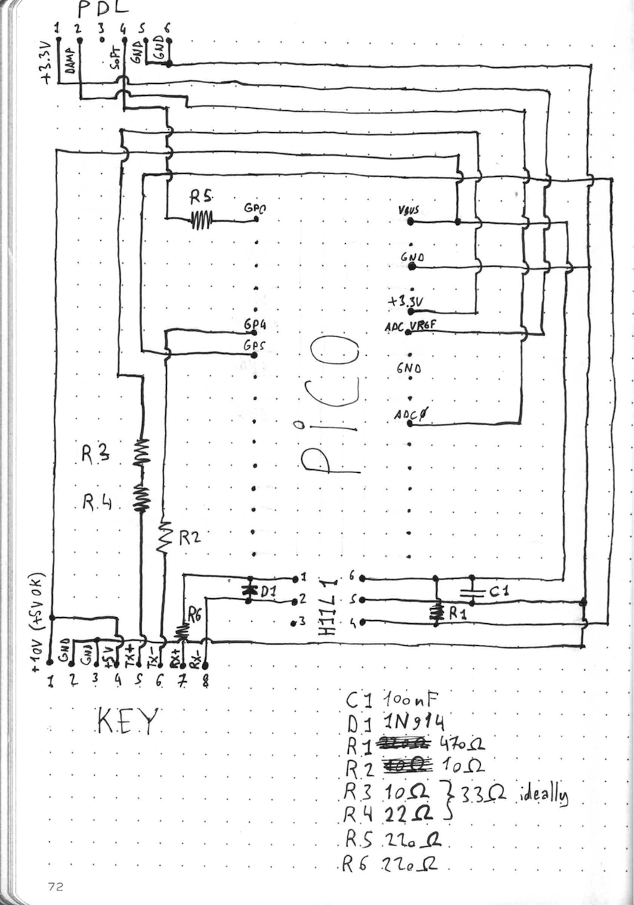
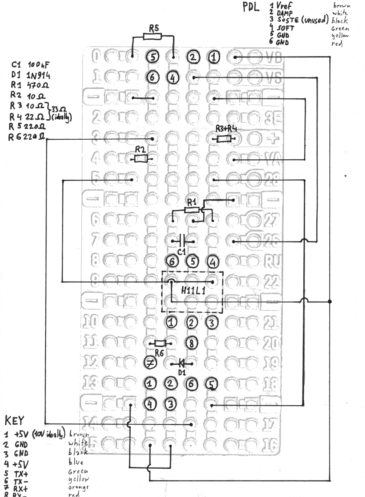

# Yamaha Silent Piano MIDI Interface

## Description

Replacement for the Switch Box Unit of a compatible Yamaha Silent Piano.
Should work on any of these models:

 - YM5SD/YU11SD/YU11W-SD
 - YU33SD/YU33W-SD

Why replacing it, you might ask? Well, to put it mildly, this specific part of
the piano did not age well... Modern synths can produce a far more convincing
piano sound.

So, let's replace the whole Switch Box Unit with a circuit that adds a
**USB MIDI Out** port to the perfectly serviceable keyboard (KEY) & pedal (PED)
units of the Yamaha Silent Piano!

## Bill Of Materials

 - Raspberry Pi Pico 2
 - 6-pin mini-DIN socket (PED connector)
 - 8-pin mini-DIN socket (KEY connector)
 - H11L1 optoisolator
 - 1N914 diode
 - 1x 10Ω resistor
 - 1x 33Ω resistor
 - 2x 220Ω resistor
 - 1x 470Ω resistor
 - 100nF capacitor

## Schematic & Assembly diagram

## Deployment

1. [Download & flash the latest CircuitPython firmware](https://circuitpython.org/board/raspberry_pi_pico2/) (10.0.0 at the time of writing)
2. Copy [boot.py](./boot.py) & [code.py](./code.py) files to the USB drive
3. USB drive & debug console are disabled by default, to enable, hold the _Soft_ pedal during boot

## References

1. https://www.tomshardware.com/how-to/raspberry-pi-pico-setup
2. https://newbiely.com/tutorials/raspberry-pico/raspberry-pi-pico-potentiometer
3. https://diyelectromusic.com/2021/02/15/midi-in-for-3-3v-microcontrollers/
4. https://diyelectromusic.com/2021/01/23/midi-micropython-and-the-raspberry-pi-pico/
5. https://github.com/Mental-Noise/Mazan
